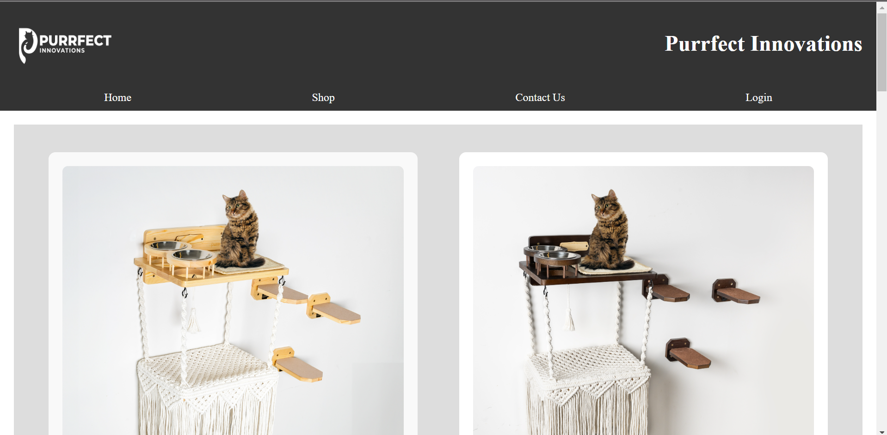

# Purrfect Innovations - E-commerce Webpage

Welcome to **Purrfect Innovations**! This is a static e-commerce webpage created to showcase products for feline-friendly home enhancements. The project is designed using only **HTML** and **CSS**, providing an interactive yet simple layout without any backend.

## 📖 Overview

This e-commerce webpage project includes the following main sections:

- **Home Page:** Introduces Purrfect Innovations and highlights the brand’s mission to provide high-quality products for cats.
- **Products Page:** Displays a selection of products, each with images, descriptions, and a button to view or add to cart.
- **Contact Page:** Allows users to get in touch with the company for inquiries or feedback.
- **Login/Signup Pages:** Provides a form-based interface for user login and registration (Note: These are purely frontend forms without backend functionality).

### 📁 Project Structure

Here's an outline of the main files in this project:

- **index.html**: Home page introducing Purrfect Innovations.
- **Products.html**: A page displaying various products.
- **Contact.html**: Contact form for user inquiries.
- **Login.html / Signup.html**: Login and signup forms for user access.
- **Styles.css**: CSS file providing styles for all pages, making the layout mobile-responsive and visually appealing.

### 🌟 Key Features

- **Responsive Design**: The website is designed to adapt to different screen sizes, providing an optimal viewing experience on both desktop and mobile devices.
- **Simple Navigation**: Users can easily navigate between Home, Shop, Contact Us, Login, and Signup.
- **Basic Forms**: Login and Signup forms for user input (without backend processing).
- **Product Showcase**: A well-structured grid layout displays products with images, descriptions, and buttons.

## 🚀 Getting Started

To view the project locally:

1. **Download the files** or **clone this repository**.
2. Open the `index.html` file in your web browser to start browsing the site.

**Note**: Since this is a static webpage without backend support, actions like login, signup, and add-to-cart are purely visual.

## 🎨 Screenshots

- **Home Page**: 
  

- **Products Page**: 
  
  

## 📄 License

This project is licensed under the MIT License - see the [LICENSE](LICENSE) file for details.

---

Enjoy browsing **Purrfect Innovations**!
